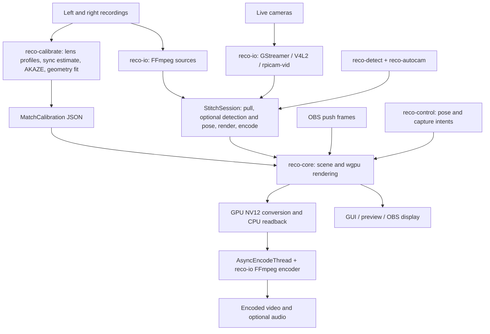

# Video Stitcher Repository Evaluation

Updated **2026-09-22** for the current Cedar V3 **1080p30** Orange Pi deployment. Reco source findings remain tied to the audited v0.5.4 revision. Historical observations and driver research are dated separately; no stitching throughput has been measured. Related reports: [offline extraction](offline-stitcher-extraction-assessment.md), [processing architecture](stitching-processing-architecture.md).

**Architecture decision update:** the local Docker worker with MinIO and the AWS S3 SDK now supersedes this evaluation’s earlier AWS-first recommendations. See [the processing architecture](stitching-processing-architecture.md) for the current implementation/POC plan; the engine and device findings below remain historical technical evidence.

## Executive Summary

**Recommendation: B — use this repository, adapting its existing library engine and I/O boundaries for an AWS processing worker. Keep the Orange Pi responsible for reliable recording, preserve both originals, and upload them for processing.** The engine is already separated into Rust crates; extracting a hidden algorithm or rewriting the renderer is unnecessary. The adaptation needed most is reliable temporal pairing and job validation, not another feature-matching implementation.

Reco performs real geometric video stitching. Its normal path decodes two videos, applies a saved two-camera calibration, renders lens-corrected textured planes with an overlapping feathered seam on a GPU, and encodes the result. It already suits a fixed rig: feature detection and geometry fitting happen during calibration, **not on every video frame**. However, the output is a virtual-camera perspective view, not automatically a full-field, cylindrical, or 360-degree panorama.

Three findings determine the architecture:

1. **Synchronization is incomplete for independent recordings.** Reco applies one integer-frame offset, then pairs by frame order. It discards source timestamps in the ordinary file adapter. Drift, actual dropped frames, and variable frame rate can break alignment later in a match. See `FfmpegFileSource::spawn_single_decoder_at` and its pairing worker in `crates/reco-io/src/adapters.rs:325–388`.
2. **The implemented fast Linux file-input path is NVIDIA-specific.** `GpuContext::supports_zero_copy` requires Vulkan plus CUDA (`crates/reco-core/src/gpu/mod.rs:520`). Normal export still reads rendered NV12 back to CPU before encoding (`session/frame_processing.rs:638`). ARM64 compilation does not imply efficient Orange Pi video processing.
3. **The specified board is an Allwinner design.** Orange Pi identifies the **4 Pro as A733**, and Allwinner identifies its GPU as **PowerVR BXM-4-64 MC1**. It is not the RK3399 Orange Pi 4, a Rockchip Orange Pi 5, or a Jetson. No A733-specific decoder, graphics interop, or NPU integration was found. [Orange Pi product listing](https://www.orangepi.org/html/hardWare/computerAndMicrocontrollers/index.html), [Allwinner A733 specifications](https://www.allwinnertech.com/index.php?a=index&c=product&id=139).

**Audit scope and evidence.** Evaluated local commit `cd3bf434b92c678a5585cd9be2330eda49782a8a` (v0.5.4), on 2026-09-13. Inspected workspace manifests, all crate/module inventories, relevant processing implementations, shaders, integration tests, CI/release configuration, scripts, friction documents, and local history. This is a broad architectural/code audit, not a formal proof of every unsafe block. Existing tracked-file differences disappear under `git diff --ignore-space-at-eol`; they were preserved. No application code was changed or dependencies installed.

**Initial audit validation limit (before SSH access).** No Rust/Cargo or FFmpeg executable is available on the local audit environment's PATH. `pkg-config` cannot locate FFmpeg, GStreamer, or Vulkan development packages. No local MP4 fixtures were found, and the initial audit had no access to the Orange Pi or an AWS GPU. Consequently, no build, unit-test run, rendered-video verification, or performance benchmark is claimed. Resource calculations below are estimates from formats and allocations. At that point camera resolution/FPS/codec, board RAM, OS image, drivers, cooling, lens geometry, and available upload bandwidth were unknown. The read-only SSH follow-up below establishes several of these facts; no Reco build or stitching benchmark has yet been performed.

**Current SSH findings (September 22):** native Cedar V3 uses one C++ GStreamer engine with two USB MJPEG inputs and **hardware H.264 encoding at 1920×1080/30 fps**, target 2.048 Mb/s per camera. Encoded tees feed paired Matroska branches, followed by native MP4 remux/validation; MediaMTX and RTSP archive readers are retired. The active release is repository-local, not `/opt/scoutcam`. The phone downloads verified completed originals and owns cloud upload. Cedar encoding does not establish a working Vulkan graphics stack; no Reco render or current-profile synchronization benchmark has been completed. See the current device section below.

## What This Repository Actually Does

Reco is a sports-video production application built around a reusable GPU engine. It combines a left and right view into a common scene and can steer a virtual camera using ball/player detections. CLI, desktop GUI, and OBS consume the same core. The core purpose closely matches a fixed pair overlooking a soccer field.

This is neither simple MP4 concatenation nor a side-by-side compositor. `Renderer::encode_stitch_pass` draws two transformed planes using perspective/view/model matrices; `fisheye.wgsl::fs_main` maps their image coordinates through lens correction and blends their overlap. The separate `stacked_video` subsystem really does pack source images into an atlas for replay; **that is distinct from the panorama renderer**.

It is also **not an OpenCV stitching engine**. The runtime is Rust plus wgpu/WGSL, FFmpeg handles video I/O, and AKAZE is vendored Rust. OpenCV appears in optional Python utilities such as `scripts/field_roi.py` and `scripts/visualize_detections.py`, not in the principal stitching pipeline. There is no useful `cv::Stitcher` hidden inside the application to extract.

The geometry model assumes two views with horizontal overlap. It does not estimate independent moving-camera poses every frame, reconstruct depth, or remove depth-dependent parallax. A rigid, closely spaced rig viewing a distant field is a reasonable fit; arbitrary camera orientations or a wide physical baseline need empirical validation.

## Repository Architecture



| Component | Implemented responsibility and main entrypoints |
|---|---|
| `crates/reco-cli` | `src/main.rs::main`, Clap `Commands`; `stitch::run_stitch`, `calibrate::run_calibrate`, preview, `info`, optional live camera/libcamera and GoPro commands. Best initial batch entrypoint. |
| `crates/reco-core` | `StitchCore` push/render API, `StitchSession` pull loop, `StitchPipeline`, `Renderer`, calibration representation, lens/projection math, GPU interop, readbacks, replay buffers, detection/control contracts. No FFmpeg/GStreamer dependency, but it does contain platform GPU FFI. |
| `crates/reco-io` | `StitchJob::run` assembles file jobs; `SmartFileSource`, FFmpeg sources/encoders, GStreamer capture, raw V4L2, `LibcameraCameraSource`, stacked replay, output/settings and JSONL events. |
| `crates/reco-calibrate` | `CalibrationPipeline`, `calibrate_with`, `features`, `ransac`, `optimizer`, lens database, IMU/audio offset estimation, and caller-supplied live frame-pair calibration. |
| `crates/reco-detect` | YOLO backend implementations: ORT CPU/GPU, native TensorRT, NCNN, and Apple-specific processing. Optional native SDKs. |
| `crates/reco-autocam` | Detectors adapted to core traits, ball/player tracking, field/sweep/file panners, filtering, lookahead camera motion. |
| `crates/reco-control` | Control-intent vocabulary, pose constraints, keyboard transport and real GoPro HTTP controls. Some module overview text still calls GoPro a placeholder. |
| `crates/reco-gui` | Slint application, calibration/playback/export/settings/preview. Not required for a worker. |
| `crates/reco-obs` | Native OBS `cdylib`, source callbacks, asynchronous frame ingestion, interactive pan/zoom, optional replay. Not required for a worker. |
| `scripts`, `resources`, `fuzz` | Capture/ROI/detection evaluation tools; embedded Gyroflow profile database and ROI editor; independent cargo-fuzz targets for calibration JSON, paths and ONNX metadata. |

Reusable orchestration is already in [StitchJob](../crates/reco-io/src/stitch_job.rs), rather than buried entirely in the CLI. A first worker can launch the CLI; a later worker can call the crates directly.

## Dependency Inventory

Versions below are manifest requirements at the audited commit; `Cargo.lock` resolves the complete transitive graph.

| Layer | Dependencies | Native/runtime implications |
|---|---|---|
| Language/build | Rust edition 2024; Rust 1.92 minimum; `rust-toolchain.toml` pins 1.92.0; Cargo resolver 3 | Modern toolchain required. Building only `-p reco-cli` avoids GUI/OBS workspace requirements. |
| GPU | wgpu 28, WGSL, bytemuck 1, nalgebra 0.35, pollster 0.4 | Working graphics driver/backend. Linux normally Vulkan; Metal on Apple; DX12 on Windows; explicit GL override exists. |
| Platform interop | ash 0.38/libc on Linux, libloading 0.9, Windows 0.62 APIs, Metal/objc crates on Apple | Driver/library-dependent unsafe interop, not portable CPU-only Rust throughout. |
| Video | `ffmpeg-next` 8, codec/format/software-scaling features | Compatible FFmpeg development headers and shared libraries; clang/bindgen and pkg-config for build discovery. CLI audio calibration also launches the **ffmpeg executable**. |
| Live GStreamer | `gstreamer` and `gstreamer-app` 0.25, feature-gated | GStreamer core/app development libraries and actual source/conversion/codec plugins. Rust binding version is not the native GStreamer version. |
| Calibration | Vendored AKAZE; ndarray 0.16/rayon, image 0.25, argmin 0.11, argmin-math 0.5, nalgebra, realfft 3 | CPU parallel image processing and numerical optimization; GPU undistortion in complete calibration path. No native OpenCV dependency. |
| Camera metadata | telemetry-parser pinned Git revision `2f4218b`; CBOR/gzip profile database | Git source fetch and matching metadata support; not guaranteed to identify arbitrary camera modules. |
| Detection | ORT `2.0.0-rc.12`; optional CUDA/TensorRT/CoreML/DirectML; NCNN/native TensorRT C++ FFI | Runtime/model artifacts must match architecture/providers. TensorRT needs CUDA/NvInfer headers and libraries; NCNN build script links ncnn, C++ and OpenMP. No A733 NPU backend. |
| UI/OBS | Slint ~1.15 with unstable wgpu-28 integration, winit 0.30, rfd; OBS bindgen 0.72 and C shim | Extra desktop/windowing or libobs prerequisites. Slint software rendering does **not** supply a software panorama renderer. |
| Utilities | Python, optional OpenCV/NumPy/SciPy in scripts; embedded HTML | Not dependencies of ordinary Rust file stitching. |

Source: root and per-crate `Cargo.toml`, `crates/reco-detect/build.rs`, `crates/reco-obs/build.rs`, and `.github/workflows/rust.yml`.

`reco-io` defaults to FFmpeg. `reco-cli` defaults to `autocam,ort`, but a plain worker can build with `cargo build --locked --release -p reco-cli --no-default-features`. That removes optional AI dependencies, **not the GPU renderer or FFmpeg**. This command is a proposed build, not a build verified here.

The project declares `AGPL-3.0-only` and all workspace crates are `publish = false`. Reuse through local/Git source dependencies is practical; this audit does not assume published crates or a permissive license. Dependency/security policies exist in `deny.toml` and CI, but no fresh vulnerability scan was possible here.

## Stitching Pipeline

The actual structure is **calibrate separately, then decode → ordinal pairing/offset → GPU warp and feather → NV12 readback → encode**. Detection and camera steering are optional side stages. In the pipeline tables, paths beginning with `reco-*` are relative to `crates/`; abbreviated render/session/shader paths are within `crates/reco-core/src/`.

| Stage | Source and function | Input → output | Library and behavior |
|---|---|---|---|
| Job entry | `reco-cli/src/stitch.rs:73`, `run_stitch` | File paths, JSON, options → `StitchJob` | Clap/serde; supports semicolon-separated file segments. |
| Configuration | `reco-io/src/stitch_job.rs:552`, `StitchJob::run` | Match calibration → GPU, source, session, encoder | Uses calibration sync offset unless explicitly overridden in builder. |
| Decode selection | `reco-io/src/smart_source.rs:151`, `SmartFileSource::open` | Files and GPU capabilities → source backend | Chooses GPU-resident platform path or CPU-resident frames. |
| Decode | `reco-io/src/ffmpeg/decoder.rs`, `VideoDecoder::open`, `next_frame`, `extract_yuv` | Compressed packets → decoded frames | FFmpeg; software or supported hardware decode, reorder/EOF drain; CPU path converts to YUV420P as needed. |
| Initial alignment/pair | `reco-io/src/adapters.rs:325–388`, `spawn_single_decoder_at` and pairing worker; GPU counterpart `zero_copy.rs:158–197` | Left/right decoded sequences → `StereoFrame` | Skips a constant number once, then pairs next/next. Not PTS synchronization. |
| Scene setup | `reco-core/src/render/pipeline.rs:99`, `StitchPipeline::with_gpu`; `render/scene.rs:77`, `SceneGeometry::from_layout_with_aspect` | Intrinsics and saved layout → scene/resources | Creates fixed scene, textures and renderer; core precomputes coverage. |
| Frame loop | `reco-core/src/session/run_loop.rs:150`, `StitchSession::run`; `session/frame_processing.rs:90`, `process_frame_any` | Stereo frame → pose and render request | Immediate or lookahead processing; optional detection/panning. |
| Upload/render | `render/pipeline.rs:450,575`, `render_stereo_frame`, `render_to_target`; `render/renderer.rs:1059`, `upload_plane` | CPU YUV planes → GPU textures | wgpu texture upload. GPU-resident input uses specialized platform methods. |
| Warp/blend | `render/renderer.rs:821`, `encode_stitch_pass`; `shaders/fisheye.wgsl:165`, `fs_main` | Camera textures, matrices, KB4 coefficients → RGBA target | Perspective geometry, per-pixel lens mapping, two draws, alpha feather. |
| Color conversion/readback | `session/frame_processing.rs:638`, `submit_render_output`; `gpu/nv12_converter.rs`, `Nv12Converter` | RGBA GPU image → CPU NV12 bytes | WGSL compute then triple-buffered mapping/copy; may block. |
| Async submission | `reco-core/src/async_encode.rs:110`, `AsyncEncodeThread::submit` | NV12 bytes → pooled queue payload | CPU copy; bounded queue with backpressure. |
| Encode/mux | `reco-io/src/adapters.rs:613`, encoder trait implementation; `ffmpeg/encoder.rs:1177,1248`, `send_current_yuv_frame`, `write_nv12_frame` | CPU NV12 → encoded packets/container | FFmpeg copies into its frame, optional hardware upload, sequential output PTS, encoder flush/trailer and optional audio copy. |

**Image operations verified in the normal render path:**

| Operation | Finding |
|---|---|
| Warping/alignment | Implemented with saved two-plane geometry and GPU perspective matrices. |
| Lens distortion correction | Implemented: four-coefficient Kannala–Brandt mapping in `fisheye.wgsl::fs_main`. |
| Crop/framing | Implemented as a virtual-camera viewport with aspect/FOV/yaw/pitch. Does not require a full panorama intermediate. |
| Overlap blending | Implemented: right plane's left-edge alpha uses `smoothstep(0, blend_width, uv.x)` (`fisheye.wgsl:231`). |
| Seam finding | No content-adaptive or moving-object-aware seam search in this path. Seam location follows saved geometry. |
| Multiband blending | Not present in normal stitching; no Laplacian pyramid/Poisson blend. |
| Exposure/color matching | Shader helper exists, but `render::renderer::build_gpu_uniforms` sets identity scale and zero offset (`renderer.rs:1262`). No automatic matching between prerecorded cameras. |
| Synchronization | Constant offset only; detailed limitations below. |

Different exposure/white balance, wrong lens profiles, spatial misalignment, parallax and temporal errors can all produce an obvious seam. A wider blend can make a moving player appear doubled; it does not solve those causes.

## Input and Output Formats

| Input/output | Actual support |
|---|---|
| `left.mp4` + `right.mp4` | Directly supported through FFmpeg. They may have been produced by GStreamer; recording provenance is irrelevant if the contained streams decode correctly. |
| Other video files | FFmpeg demuxer/decoder availability determines formats. Chained segments exist via `InputPath::Chained` and concat demuxer. Test segment continuity separately. |
| Individual images/raw frames | Library rendering accepts YUV420P/NV12 and push APIs include BGRA paths; calibration accepts frame pairs. No dedicated general still-image panorama CLI is established by this audit. |
| Live capture | Real GStreamer camera sources, raw V4L2/Bayer capture, Raspberry Pi `rpicam-vid` subprocess source, and OBS push consumer. |
| Arbitrary GStreamer pipeline | No general two-input stitching GStreamer element or production arbitrary-pipeline CLI. Existing camera builders generate specific pipeline strings. |
| RTSP | FFmpeg/GStreamer can provide the underlying protocol machinery, but ordinary file adapters validate local paths. No ready synchronized dual-RTSP source was found. GoPro RTSP URL generation is not such a source. |
| OpenCV `Mat` | No native core interface; would require conversion/adapter code, with no reason to insert OpenCV into this user's pipeline. |
| Encoded output | FFmpeg encoder supports H.264, HEVC, AV1 choices and MP4/Matroska/other configured containers, subject to actual codec/container availability. Network output configuration exists separately; `StitchJob` is file-oriented. |
| Audio | Default copy from left input; builder can choose right or disable. Not audio mixing. Source absence permits silent video. |
| Additional artifacts | Calibration JSON, optional debug visualizations, JSONL detections/pipeline events, optional stacked source replay; `.onnx`/TensorRT/NCNN models for detection. |

The regular output is **8-bit NV12** after an RGBA8 render. Some input backends support 10-bit P010 handling, but that is not an end-to-end HDR/10-bit preservation guarantee. See `StitchJob::run` session/output setup and `Nv12Converter`.

The CLI defaults to **1920×1080**, regardless of the combined camera resolution. `ViewportConfig::default` uses a **75° vertical FOV**, and ordinary stitch uses a centered view without a panner. A wide, full-field archival output needs explicit framing/coverage validation. `StitchJob::resolution` documentation says input-matching default, but `run` actually defaults to 1920×1080 (`stitch_job.rs:580`). Normal encoded output requires width divisible by four and even height (`gpu/nv12_converter.rs:96`).

## Camera Calibration and Homography

Calibration is required by normal CLI stitching. `reco calibrate` generates `match.json`; subsequent jobs load it. It is **not** a homography estimated on each frame.

| Calibration step | Implementation | Input → output |
|---|---|---|
| Probe clips | `reco-cli/src/calibrate.rs:42`; `reco-io/src/ffmpeg/calibration_io.rs::probe_video` | Files → dimensions, FPS and estimated frame count. |
| Obtain lens model | `reco-calibrate/src/pipeline.rs::load_profiles` / `detect_profiles`; `lens_database.rs` | Explicit JSON/Gyroflow profile or metadata → camera intrinsics and KB4 coefficients. |
| Estimate offset | `CalibrationPipeline::imu_sync` / `audio_sync`; CLI `try_audio_sync` | IMU/audio or manual setting → one integer frame offset. |
| Extract/undistort samples | `calibration_io::extract_frames`; `reco-calibrate/src/lib.rs::calibrate_with` | Selected pairs + supplied intrinsics → GPU-undistorted images. |
| Detect and match | `lib.rs::process_undistorted_pair`; `features.rs::detect`, `match_descriptors` | Overlap images → AKAZE binary descriptors, Hamming matches with Lowe ratio/mutual check. |
| Reject outliers | `filter.rs::spatial_filter`, `ransac_filter`; `ransac.rs::ransac_fundamental` | Matches → inliers using normalized eight-point fundamental matrix, SVD and Sampson error. |
| Fit shared layout | `optimizer.rs::optimize`, `run_nelder_mead`; `geometry.rs` | All retained pairs → constrained plane parameters using multistart, trimmed, seam-weighted reprojection objective. |
| Save | `calibrate.rs::run_calibrate`; core `MatchCalibration` | Fitted layout + original lens models + offset/rig data → JSON reused for frames. |

**Fundamental matrix and homography are different.** Here RANSAC's fundamental matrix rejects geometrically inconsistent matches. It is not a saved homography used for the warp. Rendering uses a constrained L-shaped two-plane scene with a virtual viewpoint; default fitted variables include vertical translation, overlap/intersection, virtual camera distance and plane rotations (`geometry.rs:1–26,68–105`). Perspective transforms are real, but there is no arbitrary `findHomography`/`warpPerspective` pipeline.

**The supplied intrinsics are not calibrated from scratch.** `calibrate_with` carries them into the result unchanged (`lib.rs:474–477`). For unidentified camera modules, automatic lens selection may return the first profile with matching dimensions (`lens_database.rs:319–348,601–656`). That is not evidence it matches the lens. Provide appropriate measured profiles for each camera, resolution, crop and image-processing mode.

Feature filtering expects the right half of the left view to overlap the left half of the right view, with limited vertical disparity (`types.rs`, `filter.rs:31–69`). The CLI defaults to only two sampled pairs; increase samples and inspect matches on the real field. Repetitive grass/lines, spectators, moving players, poor overlap or independent stabilization can undermine the fit.

No scene-depth model removes foreground parallax. Keep the cameras close and rigid, maintain overlap, and lock optical/electronic framing. Geometry may be reused across sessions if those properties remain unchanged; **the stored temporal offset should be re-established for each recording**.

## Video Synchronization

**This is the largest functional gap for the proposed recording system.**

Existing capabilities are useful but limited:

- Manual `--sync-offset` skips right frames when positive and left frames when negative. `StitchJob` otherwise uses `MatchCalibration.sync_offset`.
- Automatic calibration attempts IMU synchronization, then audio, then manual fallback. Arbitrary GStreamer MP4s need not contain supported IMU metadata or audio.
- CLI audio extraction launches FFmpeg for **the first 60 seconds** of each recording at 44.1 kHz mono (`calibration_io.rs::extract_audio_pcm`). `audio_sync::correlate` chooses up to 30 seconds from the middle of the supplied left samples and correlates against the supplied right samples. It does not measure drift over the whole match.
- Audio correlation computes seconds, then rounds to integer frames using left FPS. Its peak score is logged without a confidence acceptance threshold (`audio_sync.rs:104–126`, `pipeline.rs:396–413`). Silence or unrelated audio is not reliably rejected merely because a numeric result exists.

| Recording condition | Current handling and consequence |
|---|---|
| Different start times | One constant frame skip can correct an approximately integral offset. Fractional-frame exposure differences remain. |
| Different lengths | Processing ends when either sequence ends. Longer tail is not reconstructed or padded. |
| Missing frame on one side | Next/next pairing can shift all subsequent pairs if the recording did not preserve cadence through duplication. |
| VFR | Decoded timestamps are discarded by the CPU source; ordinal pairing and constant-rate output do not preserve a variable timeline. |
| PTS/time-base differences | No common timestamp mapping or nearest-time pair queue in ordinary source. |
| Clock drift | No ongoing estimation/resampling. Two identical nominal rates can still drift physically. |
| Slightly different FPS | Differences up to 0.5 fps are accepted (`stitch_job.rs:653–671`). 30 versus 30000/1001 passes: ordinal pairing can diverge by approximately **5.4 seconds over 90 minutes**, calculated from the rate difference. |
| Decode failure | Worker logs then disconnects; downstream can receive `Ok(None)` like EOF (`adapters.rs:337–341,414–423`). A partial output can appear successful. |
| Audio/video sync | Output PTS is regenerated from frame count (`encoder.rs:1177`). Audio offset is applied for the chosen camera, but passthrough audio is not drift-corrected against altered video timing. |

CLI detail: `--sync-offset 0` does not override a nonzero saved offset because `run_stitch` calls the builder only for nonzero values (`stitch.rs:143`). The library builder can explicitly override with zero. Do not reuse an old session offset accidentally.

What needs to be added or established before production:

1. Preserve capture timing: per-stream PTS/time base plus the mapping to a shared recording clock and start epoch. Independently zero-based MP4 timestamps alone do not establish a common exposure time. GStreamer distinguishes clock time, base time, segment and running time; those relationships should be recorded. [GStreamer clock documentation](https://gstreamer.freedesktop.org/documentation/application-development/advanced/clocks.html).
2. Validate starts and drift using repeated events at the beginning, middle and end. Where necessary, estimate offset and relative clock rate, e.g. `t_common = a * t_camera + b`; support discontinuities separately.
3. Pair by mapped presentation/capture time with bounded buffers, explicit skew tolerance, and documented drop/duplicate/interpolate/fail behavior. Match decoded presentation order, not compressed packet arrival or DTS.
4. Choose an explicit output cadence and audio policy. Normalize timing upstream for an initial evaluation, or add a reusable timestamp-aware source to `reco-io` for sustained use. Avoid unnecessary lossy intermediate transcodes.
5. Propagate decoder errors and validate expected duration/frame count before publishing results.

These are proposed capabilities, not existing implementation. `crates/reco-obs/FRICTION.md` already records missing temporal pairing as A5. Future API-gap work should follow the repository rule to document friction rather than hide it in consumer workarounds; this audit only records findings.

## Performance Characteristics

**No measured minimum CPU/RAM/GPU or Orange Pi/AWS throughput can be established from this checkout.** The important costs are visible:

- Calibration: GPU undistortion/readback, CPU AKAZE nonlinear scale spaces/descriptors, brute-force descriptor matching, RANSAC, multistart numerical optimization, and FFT audio correlation. These costs occur during setup, not on every video frame. Audio extraction is limited to 60 seconds in the CLI, but floating-point FFT work arrays still consume appreciable memory.
- Every frame: decode two streams; potentially convert/download their formats; upload source planes; execute lens mapping/texture sampling/blend; convert RGBA to NV12; map/copy output; encode and mux.
- Hardware fallback matters more than the shader alone. “CPU-resident source” can mean software decode **or hardware decode followed by `av_hwframe_transfer_data`**, not necessarily absence of acceleration (`decoder.rs:981–1003`).
- Optional YOLO runs at configured intervals; CLI defaults to every frame when enabled. Tracking can add lookahead buffering. Detector choice also affects which input representation can be consumed. Benchmark the actual backend and model, not just plain stitching.

**Pixel-size calculations, excluding padding and codec/driver overhead:**

| Allocation/traffic | 1920×1080 per camera | 3840×2160 per camera |
|---|---:|---:|
| One 8-bit YUV420/NV12 image (`1.5WH`) | 3.11 MB | 12.44 MB |
| One stereo pair (`3WH`) | 6.22 MB | 24.88 MB |
| CPU-to-GPU input payload at 30 pairs/s | 187 MB/s | 746 MB/s |
| 45 buffered stereo pairs (1.5 seconds at 30 fps) | 280 MB | 1.12 GB |
| 90 buffered stereo pairs (1.5 seconds at 60 fps) | 560 MB | 2.24 GB |

These are decimal MB/GB of logical data. Shared-memory GPUs may avoid a physical PCIe transfer, but staging, copies, synchronization and memory bandwidth remain costs. Input textures, decoder surfaces, queues and codec reference frames add to these values.

Output allocations also matter. `StitchCore::new` eagerly creates `RgbaReadback`: three GPU staging buffers plus three CPU RGBA vectors (`core/mod.rs:180`, `gpu/rgba_readback.rs:75–125`). The session additionally creates `Nv12Converter`: one GPU storage buffer, three staging buffers and three CPU vectors (`gpu/nv12_converter.rs:171–239`). Including one RGBA output texture gives approximately `38.5 * output_pixels` bytes: **79.8 MB at 1080p or 319 MB at 4K**, before input/codec/detection/lookahead storage. This is combined logical CPU/GPU allocation, not a prediction of process RSS; residency depends on the backend.

`Nv12Converter` attempts asynchronous readback but has a blocking fallback. `AsyncEncodeThread::submit` copies into a pooled buffer and blocks on a full queue. The FFmpeg encoder copies again into its CPU frame and may upload to hardware. Consequently, **zero-copy input does not mean zero-copy export**. NVIDIA decoding itself also copies into shared CUDA/Vulkan surfaces (`reco-io/src/zero_copy.rs::cuda_2d_copy` call sites); it avoids a host round trip.

The good news is that buffers and scene resources are substantially reused, and feather blending is much cheaper than iterative multiband/optical-flow stitching. The bad news for the Orange Pi is that two video decodes, source uploads, output readback and encoding remain even with calibration cached.

A 90-minute, 30-fps session contains 162,000 output frames. At measured end-to-end rates of 10/30/60/120 fps, processing alone would take 270/90/45/22.5 minutes. These are arithmetic scenarios, **not predicted Reco speeds**; add startup, calibration, audio finalization and transfers. Do not extrapolate the README's desktop FPS claim to this board or to a full cloud job.

## ARM64 / Orange Pi Compatibility

The manufacturer's Orange Pi 4 Pro listing names Allwinner A733. Allwinner specifies two Cortex-A76 plus six Cortex-A55 cores up to 2.0 GHz, PowerVR BXM-4-64 MC1 graphics and a 3-TOPS NPU. Its specification table lists H.264/H.265 encoding up to 4K30 and H.264 decoding up to 4K30; H.265/VP9/AVS2 decoding is listed at 4K60, while introductory prose advertises higher decode modes. These are silicon capability statements, not validated simultaneous-stream capacity or Linux application support. The A733 page also warns that submodels differ. [Orange Pi](https://www.orangepi.org/html/hardWare/computerAndMicrocontrollers/index.html), [Allwinner specifications](https://www.allwinnertech.com/index.php?a=index&c=product&id=139).

The user's installed RAM and OS/driver stack have not been supplied. A nominal GPU/API capability, available hardware encoder, or successful GStreamer recording does not prove that wgpu and FFmpeg can access those capabilities efficiently.

| Requirement | Assessment for this board |
|---|---|
| Rust/Linux ARM64 | Plausible source-build target. CI cross-checks `reco-core` for `aarch64-unknown-linux-gnu` (`rust.yml:270–285`), not full Orange Pi execution. |
| Full CLI/native dependencies | FFmpeg headers/libraries, clang/pkg-config, supported Rust, graphics loader/driver, and FFmpeg executable for audio calibration must be provided for the chosen image. Their presence on this board is unverified. |
| GPU renderer | Linux normally requests Vulkan; `WGPU_BACKEND=gl` is an override. Driver must satisfy actual wgpu textures, storage/compute and render limits. No explicit PowerVR/A733 validation was found. |
| CUDA | Optional for ordinary stitching, required for the standard Linux NVIDIA file zero-copy route; unavailable on this PowerVR hardware. |
| OpenCL | No OpenCL stitching backend in this code. OpenCL capability would not run its WGSL renderer automatically. |
| Hardware decode | Existing FFmpeg selection enumerates CUDA, VAAPI, VideoToolbox and D3D11 plus software. No explicit Allwinner/Cedar adapter or A733 buffer path. |
| Hardware encode | FFmpeg candidate list includes `h264_v4l2m2m`/HEVC equivalent. That only helps if this board's driver and FFmpeg expose a usable compatible implementation; this is not established. Software fallback is possible. |
| GStreamer acceleration | Generic raw capture can work if the camera is exposed correctly. NVIDIA NVMM is not a generic ARM acceleration mechanism. |
| NPU/YOLO | No A733-specific provider. The 3-TOPS NPU is not used automatically by ORT, NCNN or the renderer. |
| Raspberry Pi features | `rpi` is an FFmpeg build feature; `libcamera` actually launches `rpicam-vid`. Neither certifies Orange Pi support. |

The v0.5.4 release asset list inspected on September 13 included Linux x86_64, macOS ARM64 and Windows x86_64 CLI binaries, **not a Linux ARM64 binary**, despite a Linux ARM64 matrix entry in `.github/workflows/release.yml`. This reinforces the distinction between intended portability and a delivered board-tested build. [Release v0.5.4](https://github.com/reco-project/video-stitcher/releases/tag/v0.5.4).

**Practical verdict:** lower-resolution offline experimentation may be feasible after verifying drivers. Real-time stitching while recording two streams is not justified by this implementation or available evidence. A constrained board can spend its CPU/bandwidth on software codec fallbacks while also running the recording services. No percentage CPU, wattage, temperature or frame-drop rate can honestly be assigned without measurement.

## GStreamer Integration Potential

There is real integration to build upon, but it is capture-oriented. `gstreamer/camera.rs::build_pipeline_string` uses generic Linux `v4l2src ! video/x-raw ! videoconvert ! I420/NV12 ! appsink`. A separate Jetson path uses `nvarguscamerasrc`/NVMM; the ordinary Jetson path can still convert to system memory. `gstreamer/nvmm.rs` reads NVIDIA-specific surface metadata.

The generic `extract_i420`/`extract_nv12` functions allocate plane vectors with `to_vec()` (`camera.rs:155–196`), assume tightly packed planes from configured dimensions, and do not use negotiated GstVideoInfo strides there. The source pairs next/next samples. Appsinks are configured to drop buffered frames under pressure (`camera.rs:227–228`). That is a latency strategy, not a synchronization guarantee.

| Integration | Effort and suitability |
|---|---|
| Process existing MP4s | **Low initial effort.** Use existing FFmpeg `StitchJob`; no GStreamer conversion is required. Timing and optical validation remain mandatory. |
| GStreamer decode → core → GStreamer encode | **Moderate application integration** for a CPU-buffer prototype. Add timestamp pairing, correct caps/stride handling, and an `Encoder` implementation feeding `appsrc`. Not present today. |
| Tee live recordings into core | **Moderate/high integration**, including clock/queue policies and preserving independent recording reliability. Current next/next camera source is insufficient under asymmetric drops. |
| Efficient A733 hardware buffer path | **High, hardware-specific engineering.** Validate decoder/capture buffer export, ownership/fences, graphics import, formats/strides/modifiers, and encoder consumption. Existing NVIDIA DMA-buf code is only a reference for this. |
| Native `gst-launch` stitching element | **Additional plugin work.** No registered two-input Reco GStreamer element was found. It would need proper aggregation, caps negotiation, timestamps, QoS and lifecycle handling. |

A feasible prototype flow would be:

```text
GStreamer decode/appsink × 2
  → timestamp-aware pairer (new)
  → FrameSource / StitchSession / GPU render
  → CPU NV12 output
  → Encoder adapter to GStreamer appsrc (new)
  → available encoder → muxer → final.mp4
```

`appsrc` supports application-fed buffers and backpressure; the wrapper must supply an intentional timeline and respond to demand signals. [GStreamer appsrc reference](https://gstreamer.freedesktop.org/documentation/app/appsrc.html). This route still has CPU copies/readback. Wrapping buffers in OpenCV Mats would add another representation without solving timestamp or GPU interop issues.

For live recording, use a common clock/base-time relationship and preserve timing metadata; sharing a host or launching pipelines together is not hardware exposure synchronization. If a stitching branch is later added, its stalls must not block the authoritative recording branch. This is a proposed design requirement, not something established by the existing camera source.

## Fixed Two-Camera Optimization Opportunities

**The largest optimization requested already exists:** calibrate once, reuse geometry for every frame. `StitchPipeline::with_gpu` builds geometry/resources once; `update_calibration` changes it explicitly. No feature detection, matching or RANSAC is called by ordinary frame rendering.

The exact reusable workflow is:

```text
Correct per-camera lens profiles + representative aligned pairs
  → fit shared plane layout
  → save calibration
Each recording: establish its own time mapping/offset
Each paired frame: decode → warp using saved layout → feather → encode
```

Potential later optimizations, if measurements justify them:

- Keep AI/lookahead/replay disabled for initial full-field export; add them only with a measured memory budget.
- Avoid allocating unused RGBA readback buffers for an NV12-only session.
- Evaluate a precomputed inverse-map texture for a permanently fixed output viewport. The current shader still evaluates KB4 mapping per fragment; a lookup table trades arithmetic for memory/bandwidth and must be invalidated when optics/geometry/framing change. Benefit is unproven on this GPU.
- Preserve YUV/native surfaces through decode and encoding where a concrete hardware backend supports it.
- Control exposure, white balance and electronic stabilization at capture to reduce seam variation; validate settings on the actual cameras.

A single fixed warp cannot correct independent electronic stabilization, moving mounts or substantial parallax. Cache invalidation must include lens/resolution/crop changes, not just camera position. A moving virtual camera is different from moving physical cameras: Reco supports the former without recalibrating the rig.

## Edge Processing Evaluation

**Option 1 — stitch while recording: not recommended as the primary capture architecture.** Even with calibration reused, both images must be made available to wgpu and the result encoded. If originals are also retained, the device may need two source recording encodes plus the stitched encode, depending on whether cameras already supply compressed streams. If stitching is fed by decoded compressed streams, add two decodes. Shader load is only part of the budget. Existing dropping appsinks and synchronous output backpressure are especially concerning for seam synchronization and recording contention.

**Option 2 — stitch locally afterward: reasonable only as an experiment or constrained fallback.** Original capture is protected if processing starts after recording and never overwrites sources. It may run slower than real time without harming the completed match, but sustained software decode/encode, shared RAM traffic and thermal throttling could make turnaround poor. A supported graphics driver is still mandatory. Measure a complete warm-soaked job before relying on it operationally.

**Option 4 — hybrid: useful for timing and metadata, not necessarily calibration on the board.** The Orange Pi can preserve shared-clock information, camera settings, lens/rig identifiers, recording health and source checksums, and optionally export a few representative samples after recording. Calibration's AKAZE/optimization and GPU requirements make a desktop/cloud calibration step a better initial choice. Ship the small resulting JSON alongside each recording while treating its time offset as session-specific.

No numerical edge RAM/CPU/thermal prediction is warranted without camera modes and board measurements. Memory scales with source/output pixels and queue depth; lowering only the output size does not eliminate two full-resolution input decodes/uploads.

## AWS Processing Evaluation

**A containerized AWS worker is realistic.** `StitchJob` is blocking and file-oriented, creates a headless GPU context, emits progress, and writes an output. No GUI/OBS is required. There is no Dockerfile, S3 client, queue consumer or AWS deployment definition in the inspected inventory, so container packaging and job lifecycle are new integration work rather than a shipped cloud service.

| Platform | Fit |
|---|---|
| EC2 with NVIDIA GPU | Best initial implementation match: Linux Vulkan/CUDA decode interop and FFmpeg NVENC candidates already exist. Validate the complete path on a selected instance/driver. |
| ECS on GPU EC2 instances | Suitable container scheduler. Request GPU resources and expose the necessary graphics/video libraries, not only CUDA compute. AWS documents GPU task placement on EC2-backed ECS. [ECS GPU guide](https://docs.aws.amazon.com/AmazonECS/latest/developerguide/ecs-gpu.html). |
| AWS Batch on GPU EC2 | Suitable for finite recording jobs and retries. Current AWS docs describe GPU jobs and supported accelerated instances. [Batch GPU jobs](https://docs.aws.amazon.com/batch/latest/userguide/gpu-jobs.html). |
| ECS/Fargate or Batch/Fargate | Poor fit for this GPU renderer: Fargate GPU resources are unsupported. CPU orchestration is possible, but it does not provide the intended stitching acceleration. [Fargate job restrictions](https://docs.aws.amazon.com/batch/latest/userguide/fargate-job-definitions.html). |
| Ordinary CPU EC2/Graviton | FFmpeg software codecs do not replace wgpu. There is no dedicated CPU stitching backend. Software Vulkan is an unvalidated experiment with likely poor efficiency, not a production fallback established here. |
| ARM GPU EC2 | Possible in principle, but needs full ARM64 native dependencies, driver/codec and optional model-provider validation. x86_64 NVIDIA reduces initial portability uncertainty. |

A G4dn/T4 or G5/A10G class is a sensible **benchmark candidate**, not a commitment to a particular size or cost. AWS lists G4dn/G5/G6 GPU families and their resources; choose based on measured decode/encode support, resolution and future model load, rather than GPU compute FLOPS alone. Start one job per GPU with roughly **16–32 GiB host RAM as a conservative test allocation**, then size from observed peaks; this is not a minimum requirement. [EC2 accelerated-instance specifications](https://docs.aws.amazon.com/ec2/latest/instancetypes/ac.html).

Container requirements: pin source/lockfile/toolchain and compatible FFmpeg/runtime packages; make Vulkan ICD/loader and NVIDIA driver libraries available; enable graphics, video and compute capabilities as required. NVIDIA documents these as separate container driver capabilities, so a CUDA-only image is insufficient evidence that graphics rendering and video codecs work. [NVIDIA container capabilities](https://docs.nvidia.com/datacenter/cloud-native/container-toolkit/latest/docker-specialized.html).

The minimal worker boundary is local staged files: download originals and versioned calibration from S3, preflight metadata/timing, run Reco, verify output duration/frame count/seam quality, then upload the final artifact and job metadata. The S3 wrapper is not present in Reco. Local staging also avoids assuming that validated filesystem paths accept `s3://` or presigned URLs.

Provision disk for **both originals + final output + temporary/intermediate files + safety margin**. No uncompressed full-match intermediate is required by ordinary streaming frame processing. For example, 90 minutes with two 20-Mbit/s inputs produces about **27 GB** of original video; a 15-Mbit/s final adds **10.1 GB**, before audio/container overhead. Roughly 50–75 GB scratch would be a plausible starting allocation for this illustrative case, more if normalization/retry intermediates are retained. Use actual bitrates rather than these example values.

Retries are feasible because originals are retained, but resumable frame checkpoints are not implemented. `start_time` is a frame-derived trim/skip, not a complete resume/checkpoint protocol. Treat partial outputs as uncommitted until validated. Scale initially across matches, not arbitrary chunks within a match; chunking adds timestamp, GOP, audio and possible lookahead-state boundary work.

Future YOLO is supported through optional detection crates, but model format/output compatibility and soccer ball quality must be evaluated. Consider a separate CV pass over originals or the panorama so model changes do not force capture changes or unnecessarily repeat encoding. Reco's existing panners serve virtual-camera control, not every future analytics requirement.

## Architecture Comparison

Qualitative judgments below derive from the observed codec/copy/synchronization paths; they are not measured utilization figures.

| Dimension | 1: Inline on Orange Pi | 2: Local after recording | 3: Upload originals, AWS | 4: Capture metadata locally, process remotely |
|---|---|---|---|---|
| Orange Pi CPU | High/uncertain; source encodes plus rendering/I/O, possible software fallbacks | High during processing, capture unaffected if separated | Recording and upload only | Recording plus small metadata/sample tasks |
| RAM | Buffers compete with live capture; lookahead risky | Similar processing footprint, more headroom outside capture | Recording/upload queues only on board | Similar to option 3 |
| Thermal impact | Sustained additional load throughout match | Sustained post-match load | Baseline recording plus upload | Close to baseline if heavy tasks deferred |
| Dropped recording frames | Greatest contention risk; depends on isolation and codec placement | Low if processing never overlaps recording | Lowest added stitching risk on board | Low with bounded/deferred local work |
| Implementation complexity | Highest: timing, board drivers, interop, fail isolation | Moderate/high: driver and timing validation | Moderate: worker wrapper plus sync/validation | Moderate: worker plus recording metadata |
| Failure recovery | Good only if independent originals survive; otherwise match can be lost | Rerun from originals | Retry from durable originals | Same as option 3 |
| Upload/storage | Smaller uploads only if originals withheld; keeping them removes this saving | Same tradeoff | Both originals plus derived output | Same originals; small extra metadata |
| AWS compute | None for stitch; CV may still need it | None for stitch; CV may still need it | GPU worker time | GPU worker, less setup uncertainty |
| Processing speed | Must sustain camera FPS; unproven | Can be slow; likely resource constrained | Measurable/scalable GPU throughput; transfer latency added | Same processing potential as option 3 |
| Operations | Device-specific drivers, thermals, live failures | Long local jobs/device availability | Containers, jobs, storage, quotas and retries | Capture/version metadata plus cloud jobs |
| Scaling | One board's budget per match | Board becomes a processing bottleneck | Parallel jobs across matches | Same as option 3 |
| Later YOLO | Additional board burden; A733 NPU unsupported here | Competes with local turnaround | Existing NVIDIA/ORT/TensorRT choices | Same as option 3 |
| Reprocessing | Possible only when originals retained | Straightforward while originals retained | Strong: versioned original objects | Strong: originals plus rig/timing provenance |

For duration `T` seconds and summed input bitrate `B` Mbit/s, original upload size is approximately `B*T/8000` GB. The example 27-GB source pair needs **three hours at an effective 20-Mbit/s uplink** or **36 minutes at 100 Mbit/s**, before overhead. Cloud compute can be fast while transfer dominates delivery time. Preserve local files until upload integrity is confirmed and provision enough storage for queued matches.

Retaining originals costs bandwidth/storage but preserves full source resolution, alternative framing, future seam algorithms and future CV options. Reco's optional stacked replay is re-encoding/repacking; it is not necessary when the original MP4s already exist and should not replace their preservation for this project.

## Reusable Components

- **`reco-core::StitchCore`, `StitchPipeline`, `Renderer`:** GPU lens correction, plane composition and virtual camera. Suitable for a Rust integration without GUI/OBS.
- **`reco-core::source::FrameSource` and `encoder::Encoder`:** practical adapter boundaries for timestamp-aware decoding and a GStreamer output. Current encoder frames are CPU byte slices, so native GPU encode needs a richer boundary.
- **`reco-io::StitchJob`, `SmartFileSource`, FFmpeg encoder/decoder:** fastest route to a worker proof of suitability, with synchronization/error propagation addressed.
- **`reco-calibrate`:** profile parsing, AKAZE matching, robust fitting and serialization. `audio_sync::correlate` accepts PCM without file I/O. Full calibration still uses GPU undistortion.
- **`reco-calibrate::live`:** accepts caller-supplied synchronized YUV420P pairs; it does not synchronize or acquire those pairs itself.
- **`reco-detect`, `reco-autocam`:** optional YOLO and virtual-camera components. Keep their performance/model evaluation separate from first proving panorama quality.
- **Telemetry and JSONL events:** useful observability for worker validation. Progress loop FPS excludes some setup/finalization, so record whole-job wall time as well (`reco-cli/src/helpers.rs::ProgressReporter`).

Extension caveat: `Projection::wgsl_composite_source` defaults to empty (`projection/mod.rs:83`), while the actual renderer hardcodes `fisheye.wgsl` (`renderer.rs:274`). Merely finding cylindrical projection types/shaders does not prove that normal `StitchSession` can switch to a full cylindrical panorama. The generic `render_stereo_frame` also rejects `GpuResident`; those frames require platform-specific rendering methods (`render/pipeline.rs:482`).

## Missing Components

For this project, the principal missing or unproven pieces are:

1. Persistent per-camera timestamp mapping and robust temporal pairing, including drift/discontinuity policy.
2. Valid lens profiles and demonstrated calibration quality for the actual camera modules and field view.
3. Full-field output framing/quality acceptance, including a decision on perspective versus another panoramic projection.
4. Reliable worker failure detection: propagated decode errors, expected-duration checks, output validation and atomic publication.
5. Container/S3/job wrapper and versioned metadata; these can initially surround the existing CLI.
6. Efficient A733 graphics/codec interoperability, only if edge processing later becomes necessary.
7. Production GStreamer input/output adapters or a plugin for arbitrary pipelines; native buffer sharing remains target-specific.
8. Tests covering long dual-camera timing, silent/unrelated audio, dropped frames, VFR, and seam-crossing players.
9. Optional automatic photometric compensation or improved seams if capture locking and current feathering prove insufficient.

There is no need to add per-frame AKAZE, replace Rust with OpenCV, or introduce CUDA as a universal requirement merely to reuse this engine.

## Technical Risks

**Project health.** Local history contains 1,132 reachable commits, with dates from October 2025 through August 2026; HEAD is the August 7 v0.5.4 release. This includes predecessor/rewrite history, not 1,132 equally mature Rust releases. Upstream release notes and September issues show ongoing maintenance, including lens detection and model support requests. The public open-milestone API returned no open milestones during this audit; open PRs include GUI and dependency work. This is an active, substantial pre-1.0 application, not an abandoned toy, but it is not established as a hardened long-match cloud/Orange Pi worker. [Releases](https://github.com/reco-project/video-stitcher/releases), [issues](https://github.com/reco-project/video-stitcher/issues), [pull requests](https://github.com/reco-project/video-stitcher/pulls), [milestones](https://github.com/reco-project/video-stitcher/milestones).

**Test/build evidence.** Static counting found 414 `#[test]` attributes and 15 `#[ignore...]` attributes in 175 Rust source files. These are source counts, not executed tests or a coverage percentage. Useful optimizer regressions use captured GoPro/DJI/XTU correspondences (`reco-calibrate/tests/regression.rs`). However, full calibration tests need external `/media/guelzim/HDD/reco-test-footage/...` paths and are ignored; several GPU session tests are also ignored. Ordinary CI cannot establish real seam quality, driver behavior, leak freedom or complete synchronization. `.github/workflows/rust.yml` includes formatting, Clippy including profiling, tests, docs, dependency audit/deny, and cross-target checks. GPU-provider jobs are largely compile checks, with native TensorRT best-effort. Their definitions are not proof they currently pass.

| Severity for this project | Risk/evidence | Implication |
|---|---|---|
| High | Frame-order pairing, fixed offset, regenerated output PTS (`adapters.rs`, `zero_copy.rs`, `encoder.rs`) | Long-match seam and audio errors despite a good initial frame. |
| High | Decoder errors collapsed into EOF (`adapters.rs:337–341,414–423`) | A corrupt or interrupted decode can publish a short, nonempty result unless independently checked. |
| High | Resolution-only lens fallback (`lens_database.rs:601–656`) | Calibration can use the wrong optical model and still produce plausible match counts. |
| High for edge | Linux zero-copy depends on CUDA; export readback persists (`gpu/mod.rs:520`, `frame_processing.rs:638`) | Real-time A733 performance is unproven and likely dominated by I/O/codec fallbacks. |
| Medium/high | Static feather and identity color transfer (`fisheye.wgsl:231`, `renderer.rs:1262`) | Exposure mismatch, parallax and moving people can remain visible. |
| Medium | Audio correlation has no confidence threshold; calibration confidence is `min(matches/50,1)` (`audio_sync.rs`, `reco-calibrate/src/lib.rs:105–110`) | A high score is not proof of correct timing or alignment. |
| Medium | Generic GStreamer assumes packed planes and drops queued samples (`camera.rs:155–196,227–228`) | Negotiate stride correctly and test asymmetric capture pressure. |
| Medium | Optional `x_rx` optimization parameter is emitted but `geometry::apply_transformations` ignores it (`optimizer.rs:313–317`, `geometry.rs:150–179`) | Code-inspection defect candidate for optional pitch fitting; default non-IMU path disables it. Not runtime reproduced here. |
| Medium | Projection abstraction not wired into normal renderer | Alternative full-panorama output may need real renderer work, not merely configuration. |
| Medium | Platform FFI and dynamic SDK dependencies; ORT release candidate, unstable Slint/wgpu binding | Pin and validate concrete build/runtime combinations. No specific current vulnerability is asserted. |

Additional quality observations: bounded channels, buffer pools, EOF decoder draining and RAII cleanup show deliberate engineering. Nevertheless, thread creation uses `expect` in some paths, GPU/native ownership is unsafe in places, and hardware readback can block. No memory leak or data race was reproduced; static inspection cannot rule them out. `reco-cli/examples/vram_leak_repro.rs` is a useful later stress-test starting point, not proof of a current leak.

Consumer friction is candid: GUI N16 describes recording readback on the UI thread causing stalls, and OBS A3/A5 describe CPU graphics round trips and absent temporal pairing. These are reasons to use the headless session for a worker, and not to assume all frontends are equally robust (`crates/reco-gui/FRICTION.md`, `crates/reco-obs/FRICTION.md`).

Build reproducibility is better than an unpinned prototype: lockfile, Rust pin, telemetry Git revision and many pinned CI actions exist. Native packages/runner images and downloaded runtimes remain external variables. The v0.5.4 release has an additional macOS FFmpeg 9 compatibility build, illustrating that native ABI matching matters. No dependency was declared abandoned solely from its age or version. [v0.5.4 release details](https://github.com/reco-project/video-stitcher/releases/tag/v0.5.4).

## Recommended Architecture

**Keep the existing direction: record both originals on the Orange Pi, upload them, and stitch on AWS. Use Reco substantially as the processing engine, with targeted I/O and validation adaptation (B).** Do not refactor the renderer before proving the real-camera image quality.

```text
Orange Pi 4 Pro
  ├─ reliable left MP4 recording
  ├─ reliable right MP4 recording
  └─ timing + camera settings + rig/profile identifiers
        │
        └─ durable upload of originals and metadata
              │
              ▼
          AWS worker on validated NVIDIA GPU
              ├─ stage files and validate timing/metadata
              ├─ establish synchronization policy
              ├─ load/fit correct fixed-rig calibration
              ├─ Reco warp + feather + encode
              ├─ validate duration, decodeability and seam quality
              └─ publish final output and processing metadata
                    └─ later CV/YOLO processing as appropriate
```

This follows the code: the useful calibration/renderer already exist; the strongest Linux interop targets NVIDIA; the export still crosses CPU memory; and the temporal model needs work regardless of where it runs. Cloud processing does **not** automatically fix synchronization. It provides a more suitable place to validate/adapt the engine without risking the board's primary recording task.

Choose **A** only if tests establish that your recordings already have stable matched cadence, a correct session offset, acceptable optics and sufficient full-field output from the current CLI. Choose **C** if the constrained geometry or fixed feather cannot meet actual field/seam quality after correct optics/timing. Current evidence does not justify **D**, because the repository contains directly reusable solutions to much of the problem.

## Proposed Next Steps

These are follow-up experiments, not changes made in this audit.

1. **Characterize the actual recording system.** Record board RAM/OS/kernel, camera/lens models, input resolution/FPS/codec, whether cameras or the board encode, exact GStreamer pipelines, PTS/base-time handling, stabilization and exposure settings. Capture a short overlap test and a full-duration timing test with identifiable repeated events.
2. **Prove optics and timing on a desktop or GPU worker first.** Provide measured lens profiles, estimate session offset, and inspect motion across the seam at start/middle/end. Compare timestamps and frame counts; never infer long-term sync from matching nominal FPS.
3. **Run the existing CLI as the first suitability experiment.** Proposed commands below reflect actual Clap flags. Substitute a measured offset; zero is only an example. Disabling audio sync intentionally makes the chosen offset authoritative.

   ```bash
   cargo build --locked --release -p reco-cli --no-default-features
   ./target/release/reco info
   ./target/release/reco calibrate left.mp4 right.mp4 \
     --left-profile left-lens.json --right-profile right-lens.json \
     --no-auto-imu --auto-sync false --sync-offset 0 --frames 8 \
     -o match.json
   ./target/release/reco stitch left.mp4 right.mp4 \
     -c match.json -o trial.mp4 --width 3840 --height 1080 --max-frames 300
   ```

   The example 3840×1080 view is a framing trial, not a guarantee of complete field coverage. Actual `--auto-sync false` follows Clap's boolean setter; the help comment mentioning `--no-auto-sync` is stale. Once the short clip is correct, run a full match; 300 frames cannot validate drift or sustained memory/thermal behavior.

4. **Measure the complete worker.** Record selected GPU/decode/encode backends, total wall time including finalization, sustained FPS, host/VRAM peaks, disk use, output duration/frame count and visual seam behavior. Test without AI first, then the intended YOLO model/interval/lookahead. Run repository tests, Clippy including profiling, and actual binary/video tests in an appropriately provisioned environment.
5. **Address the blocking gaps before production.** Add or integrate timestamp-aware pairing, confidence/error handling and expected-output validation. Document core/consumer API friction before implementation, following `AGENTS.md`. Package a pinned worker with S3 staging and retry-safe publication only after those results are reviewable.
6. **Evaluate edge processing only if it serves a concrete need.** Start offline at low resolution, verify A733 graphics/codec use rather than software fallbacks, then perform a full-duration concurrent-recording stress test with temperature and frame-drop counters. Require sustained throughput above input rate with explicit headroom, stable memory, acceptable seam timing and no recording regression before considering inline operation.

The original evaluation created this report only; subsequent investigations added the linked reports. This September 22 refresh edits the evaluation and offline-extraction documents. Application code, configuration and existing working-tree changes were preserved.


## Current Orange Pi State — 2026-09-22

This section replaces the September 13 V2 deployment description. Read-only SSH checks and the [processing architecture](stitching-processing-architecture.md) establish the current source/runtime boundary. No capture, installation or service restart was performed. The only separately authorized remote change was correcting the runtime document's mode line to 1080p30; no device behavior changed.

### Device and deployment

| Item | Current evidence and qualification limit |
|---|---|
| Board/OS | Orange Pi 4 Pro, A733/PowerVR BXM; Debian 11, ARM64 kernel `5.15.147-sun60iw2`. |
| RAM | Earlier inspection: 5.7 GiB usable total. Current workload peak and spare capacity have not been benchmarked. |
| Storage | September 22 recheck: NVMe 469 GiB total, approximately **416 GiB available** at `/mnt/storage`. Recheck for each job. |
| Camera interfaces | Two USB V4L2 devices through stable `/dev/v4l/by-path/...video-index0` identities, requesting MJPEG. Earlier USB identification was `32e4:6678`, “4K U3 Camera”; lens calibration remains unknown. |
| Selected recording profile | **1920×1080 at 30 fps**, H.264, **2,048,000 bits/s target per camera**, video only. Selected release profile and native launch settings establish configuration; no completed recording from this selected release was qualified here. |
| Active release | `/home/orangepi/app/ScoutCam-recorder-service/dist/releases/20260921T154625565621Z-dc3c827f0b9c543d4fd1feb577ebfadb1a757fee`; `dist/current` and active capture service point there. |
| Active architecture | Native V3 Cedar capture/recorder and Wi-Fi bridge under systemd; fan control also native. V2/MediaMTX inactive, `/opt/scoutcam` archived. Docker is inactive/disabled with socket activation enabled; no Docker CLI was invoked. |
| Graphics | September 22 still shows only `/dev/dri/card0`, no render node or ICD in the standard directories checked. September 13 Vulkan instance probe failed with `VK_ERROR_INCOMPATIBLE_DRIVER`; not rerun. No working Reco graphics execution established. |
| Build tools | FFmpeg executable present; Cargo not found on the SSH PATH. Native dependency/toolchain compatibility still needs an isolated build. |

The runtime guide initially named an earlier 720p30 release. Its mode line was corrected to 1080p30 at the user's request, but the older release ID remains unchanged under that one-line authorization. Use actual service paths and the sealed `app/v3/cedar/config/capture-profile.json`, not the stale release ID. Plain build defaults remain 1080p15, so future builds must explicitly preserve both dimensions and frame rate.

### Actual capture, encoding and save lifecycle

```text
Two USB cameras, MJPEG at 1920×1080 / 30 fps
  → ONE native C++ GStreamer engine with two branches
      v4l2src do-timestamp=true
      → jpegdec → videoconvert → videorate skip-to-first=true
      → NV12 caps → identity drop-allocation=true
      → omxh264videoenc target-bitrate=2048000 (Cedar hardware)
      → h264parse → encoded tee
          ├── optional native WebRTC preview
          └── bounded paired recording branches
              → H.264 parse / AVC alignment → matroskamux
              → left.mkv / right.mkv
  → Stop reports saving, drains both sides
  → native parser/mux-only finalization to fast-start left.mp4 / right.mp4
  → validate, fsync, stream SHA-256 and byte sizes
  → atomically publish session.json, release ownership, remove staging
```

There are no active MediaMTX publishers or separate RTSP/FFmpeg archive readers in this path. JPEG decode and conversion remain CPU work; H.264 encoding uses Cedar/OpenMAX. No audio branch is configured. Encoder profile/level/GOP are not explicitly pinned by the pipeline builder. The persistent C++ engine creates/destroys the capture graph on demand; no `gst-launch` process is needed for its in-process GStreamer graph.

Remote source references, relative to `ScoutCam-recorder-service`:

- `native/engine/main.cpp:89–117,194–239`: per-camera graph, lifecycle and two hardware encoders.
- `native/engine/recording_pair.cpp:62–111,177–278`: first valid timestamped IDR gate per camera; bounded non-leaky queues; paired branch stop/EOS handling.
- `src/v3/nativeRecorder.ts:66–105`: session creation and asynchronous saving. Failure retains ownership and reports `save_failed`.
- `src/v3/archive.ts:35–78` and `native/archive/main.cpp:263–319`: no-overwrite remux, unique temporary files, media/frame validation, `mp4mux faststart`, and atomic final-file publication. No second H.264 encode.
- `src/sessionLibrary.ts:89–116`, `src/sessionTypes.ts:7–29`: fixed two-file manifest, streaming hashes, fsync and atomic completion marker. No rig/calibration identity or exposure-time mapping is stored.
- `src/v3/serviceConfig.ts:5–47`, `scripts/v3/managed_deploy.py:47–91`: validated native settings and release-selected dimensions/FPS. Build selectors are `SCOUTCAM_CEDAR_RESOLUTION` and `SCOUTCAM_CEDAR_FPS`.
- `scripts/v3/cedar_runtime.py:86–121`, `config/v3/cedar-dependencies.json`: packaged/pinned `libOmxCore`, `libgstomx` and `OMX.allwinner.video.encoder.avc`. Native capture requires `/dev/cedar_dev_ve2`. This working video stack is separate from the PowerVR graphics stack.

### Completed media, synchronization and transfer

The latest completed sample inspected belongs to the **earlier Cedar 720p30** release: H.264 High/yuv420p, 398 frames and 13.2667 seconds on both sides, approximately 2.07 Mb/s, video only. Its manifest wall-clock duration is 14 seconds. This validates neither current-profile image quality nor physical exposure alignment. No completed pair after activation of the current 1080p30 release was found during the investigation.

The shared pipeline clock improves the timing foundation, but each side gates on its own first timestamped IDR and may have different exposure/drop history. Measure common visual events at start/middle/end; equal frame counts or regular PTS are insufficient. Reco still applies an integer offset and sequential pairing, without continuous timestamp reconciliation. These video-only recordings cannot use audio correlation.

Historical September 12 V2 evidence is retained only as provenance: `scoutcam-20260912-151559` had 668 frames/44.533 seconds per side and matching indexed PTS; `scoutcam-20260912-002937` had 289,933 versus 289,932 frames over about 5h22m. Those samples used the retired software-encode/RTSP path and must not qualify Cedar V3. Earlier thermal and Docker observations likewise describe the old deployment, not current capture headroom or cooling architecture.

The recorder's loopback API exposes completed-session listing, manifest and ranged MP4 reads. V3 reuses route code in `src/v2/app.ts` through `src/v3/service.ts`; that source directory name does not mean V2 capture is active. The Wi-Fi bridge owns authenticated AP TLS access and forwards async Stop/status/events (`ScoutCam-wifi-control-service/src/recorder-bridge.ts:48–63,95–151`, `src/control-service.ts:162–190,230–273`). Activity is `idle|recording|saving|save_failed|unknown`; ownership stays asserted while saving or after failed save.

The phone waits for fresh idle and catalog visibility, downloads both originals plus manifest, verifies size/SHA-256 and owns cloud upload. This is the contract in `ScoutCam-workspace/docs/operations/v3-mobile-ai-handoff.md:141–169`. The AP has no Internet forwarding; the handoff expects cellular upload. No Pi-side AWS uploader, queue or worker was found. Mobile/backend source was unavailable, so existing cloud behavior cannot be asserted from the Pi repositories. Preserve this boundary; do not add a Pi upload daemon merely to host stitching in AWS.

### Updated recommendation and resource estimates

Preserve the working Cedar recorder and use the local Docker/MinIO worker on the RTX PC for the next stitching proof; AWS is future scale-out. Cedar removes the former software-H.264 capture bottleneck, but does not establish spare capacity for Reco rendering, decode and an additional encode. The source geometry/calibration, synchronization and missing graphics-stack concerns remain. An AWS worker consumes finalized H.264 files and does not need Cedar, USB camera drivers, MediaMTX or the Pi service stack. See the [processing architecture](stitching-processing-architecture.md) for Batch/Spot, upload barriers and the Jetson-compatible artifact contract.

At **1080p30**, a stereo YUV420P pair contains about **6.221 MB**, corresponding to **186.6 MB/s** logical CPU-source upload payload. This is 4.5 times the old 720p15 scenario. At the combined configured compressed target of 4.096 Mb/s, 90 minutes would contain approximately **2.765 GB** of originals before overhead, about **18.4 minutes at an effective 20-Mb/s uplink**. These are calculations, not current-profile game bitrate, network or stitching benchmarks.

The next acceptance evidence should use the current Cedar recording path and actual overlapping field footage, with correct resolution-specific calibration and visual timing checks. Inspect existing media first; any new capture/load test requires its own scope. No recorder redesign or graphics-driver installation is implied by this report update.

## Feasibility of Enabling Stitching on This Orange Pi

**Assessment: feasible enough to justify a bounded prototype, but not yet a working or qualified configuration.** The BXM-4-64's Vulkan capability is a positive hardware qualification. The earlier failed probe describes the **installed Linux software stack**, not an inability of the GPU to execute Vulkan. At the current **1080p30** input mode, the sensible first target remains a short offline GPU stitch with CPU-buffer I/O after graphics enablement. Processing demand is higher; an explicitly downscaled diagnostic input would require matching calibration. Cedar capture encoding now works, but does not supply Vulkan rendering. Live stitching while retaining both original recordings is a separate, harder performance and reliability gate.

### Hardware capability versus usable Linux acceleration

Vulkan support belongs to a complete GPU/driver implementation, not just an API version printed in a product specification. The Mesa PowerVR documentation consulted on September 13 lists BXM-4-64 variants `36.52.104.182` and `36.56.104.183` under active development, with Vulkan 1.2 listed. Its explicit conformance statement names `36.52.104.182`; the documentation cautions that GPUs sharing a product name can require different support according to their **BVNC hardware identifier**. Therefore, do not assume every BXM-4-64 has the same tested driver status. [Mesa PowerVR documentation](https://docs.mesa3d.org/drivers/powervr.html).

The necessary chain is:

```text
A733 PowerVR GPU
  → board clocks, resets, power and device-tree integration
  → compatible GPU kernel driver
  → matching GPU firmware
  → matching ARM64 userspace driver + dependencies
  → discoverable Vulkan ICD + loader + device permissions
  → successful wgpu device/shader execution
  → Reco render/conversion/readback
  → sufficient decode/encode throughput
```

Installing `vulkan-tools`, setting `WGPU_BACKEND=vulkan`, or installing the Vulkan loader addresses only a small part of this chain. Docker also uses the host kernel and device drivers; it cannot manufacture the missing host GPU support.

Graphics evidence below dates to September 13 unless explicitly updated. The September 22 narrow recheck confirmed the same kernel, no render node and no standard ICD; module/firmware inventories and Vulkan execution were not repeated. Driver/library combinations below are September 13 research leads, not installed or requalified bundles.

| Layer | Observation | What would need to change or be demonstrated |
|---|---|---|
| Device tree | GPU node `gpu@1800000`, compatible `img,gpu`, exists. | Verify the intended driver binds and manages the board's GPU power/clocks correctly. Node existence is not driver operation. |
| Bound driver | `/sys/bus/platform/devices/1800000.gpu/driver` is absent. | Supply a compatible GPU kernel implementation; this is more than a loader configuration problem. |
| Kernel module | No loaded PowerVR module and no `*pvr*` module files found under `/lib/modules`. | Build/package a matching module or use a coherent board image that includes it. |
| Firmware | No top-level `rgx*` firmware files found in `/lib/firmware`. | Supply the firmware requested by the selected driver/hardware revision. |
| Userspace | Installed Mesa is 20.3.5; Vulkan loader is 1.2.162. No PowerVR-specific package appeared in the inspected package inventory. | Provide a compatible PowerVR userspace implementation and ICD, with dependency/ABI validation. |
| Probe | Prior minimal Vulkan 1.0 instance creation returned `-9`. | Obtain successful instance/device enumeration and execution on the physical GPU. `-9` is `VK_ERROR_INCOMPATIBLE_DRIVER`; it is not evidence that the hardware lacks Vulkan 1.2. [Khronos VkResult reference](https://registry.khronos.org/VulkanSC/specs/1.0-extensions/man/html/VkResult.html). |
| Video engine | September 22 native capture uses Cedar/OpenMAX through `omxh264videoenc` and `/dev/cedar_dev_ve2`. | Hardware H.264 encoding is established in the recorder. Reco output integration and hardware decoding remain separate work; Cedar does not provide Vulkan. |

The exact GPU BVNC was **not read from running hardware**, because no GPU driver was bound. The checks did not load modules, exercise video-engine devices, install packages, start cameras or change configuration.

### Two plausible driver routes

**Route 1 — vendor PowerVR stack: investigate first for this existing BSP kernel.** Orange Pi's official `orange-pi-5.15-sun60iw2` kernel branch contains `bsp/modules/gpu/img-bxm/linux/rogue_km`. Its `include/pvrversion.h` identifies **24.2.6603887**. The vendor's installation instructions require the matching kernel headers/build environment. Orange Pi also publishes a `orange-pi-6.6-sun60iw2` branch containing the GPU module sources. This establishes availability of board-family driver source, not compatibility with the exact installed kernel build. [Orange Pi PowerVR source](https://github.com/orangepi-xunlong/linux-orangepi/tree/orange-pi-5.15-sun60iw2/bsp/modules/gpu/img-bxm/linux/rogue_km), [driver version header](https://github.com/orangepi-xunlong/linux-orangepi/blob/orange-pi-5.15-sun60iw2/bsp/modules/gpu/img-bxm/linux/rogue_km/include/pvrversion.h), [build instructions](https://github.com/orangepi-xunlong/linux-orangepi/blob/orange-pi-5.15-sun60iw2/bsp/modules/gpu/img-bxm/linux/rogue_km/INSTALL).

Radxa's official A733 Linux overlay includes `libVK_IMG.so.24.2.6603887`, associated PowerVR libraries, and `rgx.fw.36.56.104.183` / `rgx.sh.36.56.104.183`. **The DDK version match is a concrete compatibility lead.** It does not authorize copying the entire Radxa overlay over this Orange Pi or prove compatibility with Bullseye, the installed kernel, or the exact silicon revision. Resolve the driver/firmware/userspace bundle together, inspect dependencies and redistribution terms, and keep Orange Pi-specific boot/device-tree configuration. [Radxa A733 overlay](https://github.com/radxa/allwinner-target/tree/target-a733-v1.4.6/debian/cubie_a7a/overlay).

The work is to establish the kernel build/configuration, compile or obtain a matching module, verify clocks/power and firmware loading, package the ARM64 userspace libraries, register a correct ICD, and validate access under the intended service user. Headless rendering should be the target: Reco file stitching does not need a desktop, Xorg, or HDMI presentation. A working desktop demonstration alone would not prove its compute/readback path.

**Route 2 — modern upstream kernel plus Mesa PowerVR: an alternative with more platform-integration uncertainty.** Mesa's driver uses the upstream PowerVR DRM interface. It is not simply a replacement userspace library for arbitrary vendor `pvrsrvkm` builds. Verify exact BVNC support, a compatible kernel/firmware interface, and A733 board enablement before selecting this path. Installing a newer Mesa package alone on this 5.15 BSP would not complete that work. [Linux PowerVR driver documentation](https://docs.kernel.org/gpu/imagination/index.html), [PowerVR kernel UAPI](https://docs.kernel.org/gpu/imagination/uapi.html).

Test either route on a separately bootable clone/spare system image in an attended maintenance session. Preserve the working recorder image and a verified restore path. A kernel/image change would require requalification of USB cameras, NVMe, Wi-Fi control and fan/PWM behavior as well as graphics. This is a proposed future test arrangement; no image or driver was changed in this assessment.

### What Reco would require once Vulkan works

The first implementation should keep Reco's renderer substantially unchanged:

1. **Build the ARM64 CLI with optional AI disabled.** Use the pinned Rust 1.92 toolchain, `Cargo.lock`, compatible native FFmpeg development libraries, clang/pkg-config, and the runtime library versions used by that build. Build on a separate ARM64 machine/container or cross-compile against a matching target sysroot to avoid competing with recording. The FFmpeg 4.3.9 observed in the original inspection warrants a real compatibility build; do not assume that its version alone either guarantees compatibility or demands replacing the recorder's FFmpeg.
2. **Validate wgpu beyond `vulkaninfo`.** `GpuContext::with_surface` / `request_device_with_fallback` in `crates/reco-core/src/gpu/mod.rs` request actual device features and limits. Test YUV texture uploads, RGBA render targets, shader compilation, storage-buffer compute and mapped readback. `rgba_to_nv12.wgsl` uses a 16×4 compute workgroup and writes packed bytes through a storage buffer. A successful Vulkan instance is only the first gate.
3. **Start with the existing CPU-resident input path.** CUDA is not required for rendering. The PowerVR GPU can theoretically render uploaded YUV planes through wgpu without implementing NVIDIA-style zero-copy. Native NV12 texture support is optional in GPU setup; the ordinary planar YUV420P route is the simpler initial target.
4. **Use CPU NV12 output plus a known software encoder first.** Explicitly select `libx264` for a controlled functional test, with no AI/lookahead/replay. Measure before replacing the encoder. Hardware video acceleration is not required to prove the warp works, though it may be necessary to meet live power/CPU requirements.
5. **Prepare correct optics and timing.** Calibrate on a desktop/cloud machine if convenient; copy only the appropriate calibration into the test setup. These video-only recordings need a measured visual/manual sync offset or timestamp mapping, not automatic audio sync. Validate the full-field viewport and seam before judging throughput useful.

A short **offline** two-file trial is therefore the shortest path to a meaningful result. It avoids creating a new live source, changing capture ownership, or proving every hardware-buffer-sharing mechanism at once. If ordinary rendering fails, capture wgpu validation/driver errors and distinguish a Reco requirement from a PowerVR driver bug before deciding whether code changes are necessary.

### What live-stream stitching would add

There are two materially different integration choices:

| Choice | Work required | Load and recording implications |
|---|---|---|
| Add an isolated consumer of the native encoded tees | A new bounded transport/source adapter must expose encoded frames with timing, lifecycle and failure handling; no current RTSP publishers exist. | Preserves camera ownership but modifies the native engine boundary. Adds two H.264 decodes, rendering/readback and another encode. Not an existing plug-in integration. |
| Feed decoded raw frames from the capture branches | Add correctly isolated tees/appsinks after raw conversion/rate normalization; carry common-clock timestamps into a stitch adapter; implement deliberate backpressure and recording-priority behavior. | Avoids decoding the just-encoded H.264 streams, but changes the qualified capture pipeline. Requires recorder/capture lifecycle and failure-isolation requalification. Consider only after offline success and measuring the encoded-input alternative; preserve the working native capture lifecycle. |

Neither choice is currently implemented by dropping Reco into a `gst-launch` string. Its existing generic camera backend opens cameras itself and pairs next/next frames; starting it beside ScoutCam would conflict with current camera ownership. Its Jetson NVMM path is NVIDIA-specific.

Keep source archival intact for both choices. A slow stitching branch must not stall camera acquisition, and independent frame drops must not silently change pairing. A live policy needs to distinguish dropping an aligned pair, duplicating a missing image, reporting excess skew, and stopping only the derived output. It also needs a bounded output queue: the existing `AsyncEncodeThread` blocks when its queue fills.

### GPU acceleration and video codec acceleration are separate tasks

Vulkan accelerates Reco's warp/blend/color conversion. The current recorder already uses Cedar hardware H.264 encoding through GStreamer/OpenMAX; JPEG decode/conversion remain software work. This is a separate video-engine stack and does not enable Reco's PowerVR graphics path. No Cedar-to-Reco encoder or hardware H.264 decoder integration has been qualified.

If profiling identifies codec cost as a blocker, investigate adapting the already packaged Cedar encoder to Reco output and separately establish a supported decoder route. Prove formats, resolution, frame rate and concurrency before integrating through `Encoder`/`FrameSource`. Do not assume a third encoder can coexist with the two capture encoders or that the native recorder backend automatically plugs into FFmpeg. Existing Reco FFmpeg `v4l2m2m` candidate names do not prove the Allwinner vendor video-engine interface implements V4L2 M2M.

Only after this should native buffer sharing become a goal. Passing a DMA-buf descriptor is insufficient by itself: graphics/video drivers must agree on formats, strides, modifiers, ownership, cache handling and synchronization. Reco's current normal output interface is CPU bytes, so direct GPU-to-hardware-encoder operation would require additional API/backend work. Follow the repository's `FRICTION.md` rule before designing consumer workarounds.

At **1080p30**, the copying and output work must be measured at the intended viewport:

- Two input YUV420P frames: approximately **6.221 MB/pair**, **186.6 MB/s** logical upload payload.
- A proposed 2560×720 wide output: **55.30 million output pixels/s** at 30 fps and **82.9 MB/s** NV12 readback payload. This is a test viewport, not a guarantee of full-field coverage.
- Existing output texture/readback/converter allocations at that output size: approximately **71.0 MB**, before input textures, codec buffers, queues and other services, using the earlier `38.5 × pixels` calculation.

Those figures exclude repeated memory copies and shader texture traffic. They show why proving the simple path before engineering zero-copy is reasonable; they do not predict CPU utilization or FPS.

### Staged acceptance and indicative effort

These are engineering planning estimates for one developer familiar with Linux graphics and the project, not measured completion times or guaranteed schedules. A kernel/firmware incompatibility can dominate all later work.

| Stage | Concrete completion evidence | Indicative effort |
|---|---|---|
| 1. Establish a coherent driver bundle on a test image | PowerVR driver binds; correct firmware loads; ICD enumerates the physical BXM device under a non-root account; basic compute/render test succeeds. | A few days if a compatible vendor bundle builds cleanly; **1–3+ weeks** if kernel integration, ABI or board-power fixes are required. No firm upper bound for driver defects. |
| 2. Build Reco and prove offline output | ARM64 CLI runs; correct calibrated image from real paired files; decode/render/readback/encode all succeed without software-renderer substitution. | Approximately **2–5 working days after stage 1**, assuming no significant shader/driver defect. |
| 3. Qualify sustained offline processing | Full-match output, stable memory, acceptable seam/time alignment, measured wall time/thermals, recoverable failures. | Several engineering/test days plus complete-duration runs; do not infer this from a 300-frame sample. |
| 4. Add and qualify isolated native-engine stitching input | New bounded encoded/raw adapter, correct clock mapping, failure isolation, archives preserved, full-duration concurrent test. | Separate integration work, provisionally **1–2+ weeks after offline success**, potentially longer for native ownership/transport changes. |
| 5. Optimize raw capture or hardware codec/buffer paths if needed | Demonstrated benefit without capture regressions; correct ownership/fences and recording-priority behavior. | A separate **multi-week effort**, potentially much longer without a supported vendor codec API. Not required for the first offline proof. |

For the current 30-fps sources, an illustrative live qualification target is at least **40 fps sustained offline processing** at the intended output size, followed by a full-duration test **while the normal recording workload also runs**. That margin is a proposed acceptance target, not a promise of performance. A pipelined system can have latency greater than one frame interval while sustaining the required throughput; measure both rather than imposing a misleading 33.3-ms total-latency requirement.

Additional gates: no steady memory growth or swapping, acceptable sustained temperature using an agreed ceiling, no archive truncation, bounded pairing skew demonstrated with common visual events, and recovery that leaves both original recordings usable. Recheck both preview-already-running and initially-idle archive starts. Ordinary MP4 PTS equality alone is not sufficient evidence.

**Revised feasibility conclusion:** the hardware capability and available vendor sources make **offline stitching a credible experiment**, but current **1080p30** performance remains unmeasured. The unresolved blocker is a usable graphics stack, with a concrete matching-DDK lead to investigate. Reliable live stitching remains conditional on driver stability, timestamp pairing and the CPU cost of codecs. Keep AWS as the working architecture until those gates pass; successful Vulkan enablement alone would not yet justify moving stitching into the recording path.
